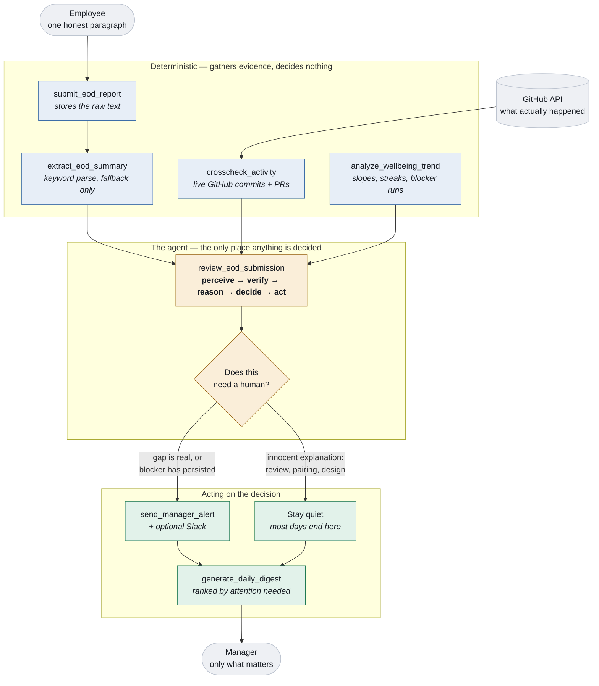

# GroundTruth

**AI agent for EOD-driven team intelligence in IT companies.**

Employees write one honest paragraph a day. GroundTruth's MCP agent verifies it against what actually happened in GitHub, and tells managers only what really matters — before they have to ask.

Built for the **NitroStack × Amrita University Hackathon** — Track: Enterprise AI & Workplace Automation.

---

## The problem

Every IT company runs on End-of-Day reports, and the process is broken. Reports scatter across Slack, email, and spreadsheets. Managers skim ten to twenty a day without verifying any of them. What someone *claims* — "finished the login module" — often doesn't match what actually landed in GitHub, and nobody checks. By the time a recurring blocker surfaces in a standup, three or four days of productivity are already gone.

There is no system that verifies self-reported work against real activity, and none that proactively tells a manager what needs their attention instead of making them dig for it.

## The solution

GroundTruth is an MCP server that reads daily EOD reports, cross-checks them against live GitHub activity, and surfaces only what genuinely needs a manager's attention.

The important design decision: **every tool in this project is deterministic.** They fetch, diff, store, and notify. Not one of them decides whether something matters. That judgement lives in the `review_eod_submission` prompt, where the connected model reasons over the evidence and chooses its own next action. A scoring function with hardcoded thresholds would be an if-statement wearing a costume — this is what makes GroundTruth an agent rather than a report parser.

### The agent loop

For each submitted report, the model works through:

1. **Perceive** — read the report and the claims parsed out of it (`extract_eod_summary`)
2. **Verify** — pull the employee's real commits and PRs for that date (`crosscheck_activity`)
3. **Reason** — weigh claimed work against real activity, and against prior days' blockers
4. **Decide** — nothing to raise / worth noting / raise at standup / needs attention today
5. **Act** — call `send_manager_alert` only where it judged one warranted

The prompt explicitly instructs the model that a low match score is *not* on its own a reason to alert: meetings, design work, pairing, and code review all legitimately leave no commit trail. An agent that stays quiet when nothing is wrong is more useful than one that cries wolf.

Claim extraction follows the same principle. `submit_eod_report` parses the report with
keyword matching so there is always *something* to compare, but that parse splits on
punctuation and cannot tell "finished the login module" from "still finishing the login
module". So `crosscheck_activity` accepts a `claims` array from the caller, and the prompt
tells the model to read the raw text and supply its own. The deterministic parse is the
fallback; the model's reading is the authority.

## Architecture

The split below is the whole design. Everything on the left is deterministic — it
fetches, diffs, stores, and notifies, and decides nothing. Everything the agent does
is judgement, and it happens in the model reading the prompt. Move the decision into
a tool and this stops being an agent.



Why it matters that the decision sits where it does: a scoring function with hardcoded
thresholds would produce the same alerts on the same inputs, but it could never tell
that a designer with no commits is fine while a backend engineer with no commits and a
completion claim is not. The tools cannot make that distinction. The model can, and the
prompt is what asks it to.

### Project layout

```
src/
├── app.module.ts            # registers the feature modules and health checks
├── index.ts                 # bootstrap
├── health/
│   ├── system.health.ts     # memory and uptime
│   ├── github.health.ts     # GitHub credentials and rate limit
│   └── storage.health.ts    # whether report data is reaching disk
├── lib/
│   ├── text.ts              # claim / blocker / sentiment extraction (deterministic)
│   └── uri.ts               # URI-template parameter matching for resources
├── store/
│   ├── store.ts             # single-file JSON persistence, non-fatal on write failure
│   └── types.ts             # domain types
├── modules/
│   ├── eod/                 # what people say they did, + the agent loop prompts
│   ├── github/              # what actually happened, per the GitHub API
│   ├── alerts/              # how the agent escalates (incl. optional Slack delivery)
│   ├── insights/            # trends, search, and manager Q&A across days
│   └── demo/                # seeding helpers (the one module a real deploy drops)
└── widgets/                 # React widgets, one per surfaced tool
scripts/                     # seven offline test suites (see Testing)
docs/DEMO_SCRIPT.md          # the 3-minute demo, beat by beat
```

The demo walkthrough — pre-flight checklist, timings, and what to do when something
breaks mid-take — is in [docs/DEMO_SCRIPT.md](docs/DEMO_SCRIPT.md).

### Tools

| Tool | Purpose |
|---|---|
| `open_eod_form` | Renders the submission form widget |
| `submit_eod_report` | Stores a report and pre-parses claims, blockers, sentiment |
| `extract_eod_summary` | Re-parses a stored report into structured claims |
| `crosscheck_activity` | Pulls live GitHub commits/PRs and scores claim support |
| `send_manager_alert` | Raises an alert — called only when the agent decides to, and posts to Slack if configured |
| `resolve_manager_alert` | Clears a handled alert |
| `generate_daily_digest` | One team's dashboard, every row, ordered by attention needed |
| `generate_org_digest` | Every team at once: per-team health plus the people needing attention org-wide |
| `analyze_wellbeing_trend` | Confidence, tone, and recurring blockers across days |
| `get_employee_detail` | One person's full history — the digest says who, this says why |
| `generate_weekly_summary` | What kind of week a team had: reliable, stuck, wearing down, quiet |
| `search_reports` | Keyword / person / date-range search over stored reports |
| `seed_demo_data` | Seeds history. `realistic` (default): 12 people, two teams. `demo`: the original four, sized for a recording. |
| `reset_demo_data` | Clears reports, cross-checks, and alerts |
| `set_employee_github` | Points an employee at a real GitHub login |

### Resources

| URI | Contents |
|---|---|
| `team://employees` | Team roster with GitHub usernames |
| `eod://reports/{employeeId}/{date}` | One report plus its cross-check result |
| `github://commits/{employeeId}` | Today's commits, live from GitHub |
| `github://pull-requests/{employeeId}` | Today's PRs, live from GitHub |
| `alerts://team/{teamId}` | Open alerts for a team |

### Prompts

| Prompt | Purpose |
|---|---|
| `review_eod_submission` | The core agent loop for one employee |
| `review_team_day` | Runs the loop across a whole team, then renders the digest |
| `ask_about_team` | Answers a manager's open question from the stored data |

### Widgets

| Widget | Shown by |
|---|---|
| `eod-form` | `open_eod_form` — employee submission form |
| `crosscheck-result` | `crosscheck_activity` — claimed vs. actual, side by side |
| `team-digest` | `generate_daily_digest` — manager dashboard |
| `wellbeing-trend` | `analyze_wellbeing_trend` — confidence sparklines per person |
| `org-digest` | `generate_org_digest` — team cards plus the org-wide concerns |
| `employee-detail` | `get_employee_detail` — one person's timeline, blockers, alerts |

## Environment setup

Requires Node.js 20.x (18+ minimum) and npm.

```bash
npm install -g @nitrostack/cli
```

Copy the example env file and fill in your own values — **never commit `.env`**:

```bash
cp .env.example .env
```

| Variable | Required | Description |
|---|---|---|
| `GITHUB_TOKEN` | yes | GitHub Personal Access Token (classic), `repo` read scope. Used by `crosscheck_activity`. |
| `GITHUB_ORG` | yes | GitHub org or username owning the repos to inspect |
| `GITHUB_REPOS` | no | Comma-separated repos to restrict the check to. Blank scans the org's 30 most recently pushed repos. |
| `GITHUB_API_URL` | no | API base override, for GitHub Enterprise or the integration test's mock |
| `SLACK_WEBHOOK_URL` | no | Post alerts to a Slack channel as well as recording them. Blank means nothing is ever sent. |
| `DEMO_AUTOSEED` | no | Re-seed demo history on boot when the store is empty. Useful on a deployed instance, where a redeploy starts with an empty data file. Never overwrites existing reports. |
| `NITRO_LOG_LEVEL` | no | Defaults to `info` |

The default roster is twelve people across `team-platform` and `team-mobile` — the size
at which ranking, search, and team questions mean anything, since a four-row digest reads
as a fixture. `seed_demo_data({ scale: 'demo' })` narrows it to the original four for a
short screen recording, where twelve rows will not fit.

Only `emp-1` is wired to a real GitHub account — point it at yours with the
`set_employee_github` tool, and **pass `githubEmail` too**, set to the output of
`git config user.email` on the machine making the commits. GitHub links a commit to an
account only when the commit's author email is registered there, so a mistyped git email
leaves every commit unlinked and a login-only lookup finds nothing — reporting "no commits"
while someone committed all day. Supplying the email lets attribution fall back to it. The other three keep fictional logins on purpose, so they
return no commits. Giving everyone the same real username would attribute the same
commits to all four, and the employee whose role in the demo is to legitimately *have*
no commits would appear to have them.

## Installation

```bash
git clone https://github.com/Vimaladharsan/GroundTruth-NitroStack.git
cd GroundTruth-NitroStack
npm install
npm run dev
```

Then connect the project in **NitroStudio**: *Add Server → Nitro Project*, browse to this folder, and open it in **Studio App Canvas**.

## Usage

**Demo setup:**

```bash
npm run demo:prepare                    # local
npm run demo:prepare -- <service-url>   # a deployed instance
```

Checks health, wires `emp-1` to the GitHub identity from `DEMO_GITHUB_LOGIN` /
`DEMO_GITHUB_EMAIL`, and seeds three prior days. Several signals only mean anything
across days, so the history has to exist before any of it is worth showing. Today is
deliberately left empty — submitting it live is the demo's second beat.

Re-run it after every redeploy: a new container starts with an empty data file.

To do it by hand instead: `set_employee_github`, then `seed_demo_data` with `days: 3`.

**The flow:**

1. Run `open_eod_form` and submit today's report through the widget. Try a claim that overstates things, like "finished the login module", while your actual commits that day are something else.
2. In Studio's **AI Chat**, run the `review_eod_submission` prompt for that employee. Watch the agent call `crosscheck_activity`, reason about the gap out loud, and decide for itself whether to alert.
3. Run `generate_daily_digest` for the manager's dashboard, worst row first.
4. Run `analyze_wellbeing_trend` to see the multi-day picture — the recurring blocker and the confidence slide.
5. Try `ask_about_team` with a real question: *"what has been blocking the team this week?"*

The seeded team is four deliberately different cases, and the interesting one is Karthik: his work is review, pairing, and design, so he leaves almost no commits. A system that flags him is producing false positives. The prompt is written to make the agent recognise that and stay quiet.

## Testing

```bash
npm run verify
```

Builds, then runs eight suites — **135 assertions total**, exiting non-zero on any failure.
No credentials or network access required.

| Suite | Command | Covers |
|---|---|---|
| Unwrap | `npm run test:unwrap` | 15 — normalising every MCP envelope shape a widget host might send |
| Smoke | `npm run smoke` | 42 — the full MCP surface over stdio: registration, submission, extraction, alerting, digest ordering, trend signals, search, prompts, health |
| GitHub | `npm run test:github` | 20 — the real fetch path against a local mock GitHub API, including commits GitHub never linked to an account |
| Read-only | `npm run test:readonly` | 6 — the server still boots and serves when the data directory cannot be written |
| Slack | `npm run test:slack` | 12 — optional alert delivery, including every failure mode |
| Blockers | `npm run test:blockers` | 8 — a blocker reported across days is one blocker, however it is reworded |
| Insights | `npm run test:insights` | 18 — the drill-down and weekly rollup, including that a quiet week reads as quiet |
| Caveats | `npm run test:caveats` | 14 — caller-supplied claims override keyword extraction; auto-seed never clobbers real data |

Three properties worth calling out, because they are the ones that break quietly:

- **The GitHub path is tested without a token.** `npm run test:github` stands up an HTTP
  server speaking GitHub's REST shapes and points `GITHUB_API_URL` at it, so auth headers,
  the date-window query, response parsing, claim matching, and verdicts are all exercised
  for real. Three scenarios: claims supported by commits and a PR, a completion claim with
  only an unrelated commit, and a genuine no-commit day.
- **Absence of false signals is asserted, not just presence of real ones.** The healthy
  employee and the non-code employee must both come back unflagged. A system that flags
  the person doing code review and design is producing false positives, and that is the
  failure mode most likely to make this useless in practice.
- **`crosscheck_activity` passes with or without a token.** With one it hits the real API;
  without one it must return a clear configuration error rather than crash.
- **A notification failure is never an escalation failure.** If Slack is down, rejects the
  webhook, or hangs, the alert is still recorded and `send_manager_alert` still reports
  success — because the escalation did happen. The tests cover all three cases, and no
  message is ever sent anywhere real.

The sparkline palette in `src/widgets/app/_shared/tokens.tsx` was chosen by running a
contrast/colour-blindness validator against each theme's surface rather than by eye, and
carries a text trend label alongside the colour so the chart never encodes state in hue alone.

## Deployment

Deployed to NitroCloud, with this repository's default branch connected for auto-deploy on
push. See the NitroStack Studio Handbook for the Studio deploy flow and GitHub auto-deploy
setup.

Two things behave differently once deployed:

**Environment variables do not travel with the code.** `.env` is gitignored — correctly, it
holds a token — so the deployed instance has no GitHub credentials until `GITHUB_TOKEN`,
`GITHUB_ORG`, and `GITHUB_REPOS` are set in the NitroCloud app's own environment settings.
Until then every cross-check returns a configuration error. Read `health://checks` on the
deployed instance to confirm: the `github` check reports `up` with a rate limit when the
token is working, and `down` with the specific reason when it is not.

**Storage is per-container and may be ephemeral.** Reports live in `data/groundtruth.json`
relative to the working directory, so a redeploy can reset them — re-run `seed_demo_data`
afterwards. If the directory is not writable at all the server does not crash; it keeps
serving from memory and the `storage` health check reports `degraded`.

## License

MIT — see [LICENSE](LICENSE).
